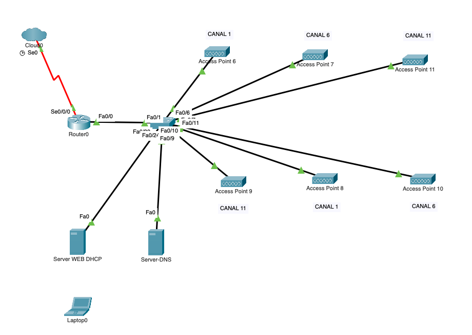
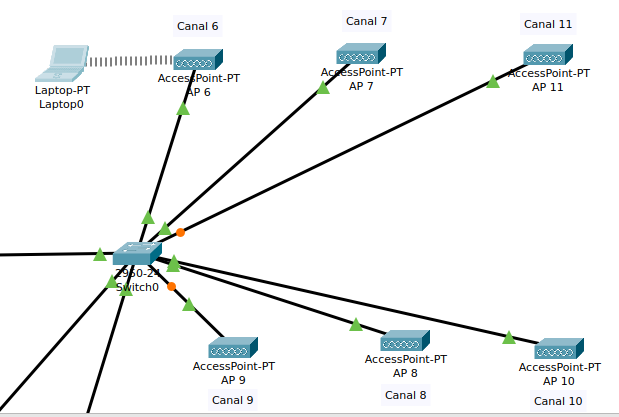
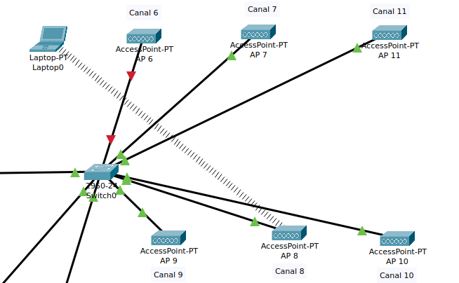
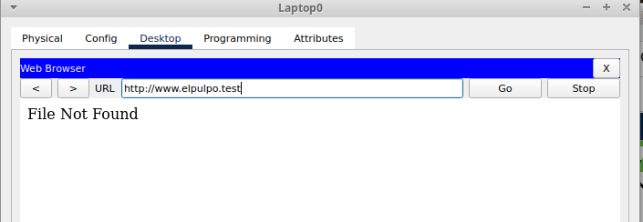

# CONFIGURACIÓN DE PUNTOS DE ACCESO WIFI

Dado el siguiente esquema de red:

Y el direccionamiento `IP`  siguiente:

| Dispositivo       | Interface     | Dirección IP    |
| ----------------- | ------------- | --------------- |
| Router0           | Fa0/0         | 192.168.1.1/24  |
| Router0           | Serial0/0/0/0 | 83.57.97.33/16  |
| Server WEB - DHCP | Fa0/0         | 192.168.1.5/24  |
| Server DNS        | Fa0/0         | 192.168.1.6./24 |
| Laptop0           | Wireless      | DHCP            |               |                 |

### REQUISITOS

Supongamos una planta de edificio que necesita 6 puntos de acceso WIFI para ser completamente cubierta

1.  Queremos permitir la movilidad de los usuarios por todo el edificio y ciertas medidas de seguridad, así que debemos tener en cuenta lo siguiente:
+ Todos los puntos de acceso usarán cifrado WPA2-PSK con AES.  
+ A todos los puntos de acceso pondremos el  SSID **asir** y la  contraseña **1q2w3e4r** .Distribuiremos los canales de forma que en las zonas de mayor solape la diferencia entre canales sea mayor que 4.

2.  Configuraremos un servidor **DHCP** con la IP `192.168.1.5`, que repartirá direcciones entre la `192.168.1.100/24` y la `192.168.1.254/24`, como servidor **DNS** mandará a los clientes la dirección `192.168.1.6` y como puerta de enlace les asignará la `192.168.1.1`

3.  El servidor DNS tendrá la dirección `192.168.1.6` y debe resolver que los nombres de dominio www.elpulpo.test y elpulpo.test están en la ip `192.168.1.5`.

4.  La máquina `192.168.1.5` además de ser el servidor **DHCP** será un servidor web cuya página por defecto nos dará la bienvenida a la red wifi de el pulpo.

### COMPROBACIONES

1. Configurar un portátil para que acceda a la red wifi. Cuando esté conectado hacemos un `ping` a uno de los servidores comprobando que hay conexión.  

 + Ping a **Server WEB DHCP**
~~~

~~~

 + Ping a **Server DNS
~~~

~~~

2. Apagamos el punto de acceso al que se conectó el portátil y comprobamos que automáticamente se conecta a otro punto de acceso. Si los APs tuvieran diferentes configuraciones tendríamos que reconfigurar el portátil para conectarnos a otro.

+ Captura de pantalla con el **Laptop0** conectado a el primer punto de acceso:

+ Captura de pantalla con el **Laptop0** conectado a otro punto de acceso después de apagar el primero al que se conectó automáticamente:

4. En el navegador del portátil escribir www.elpulpo.test y comprobar que nos envía a la web adecuada.  

4. En el portátil usar el comando `ifconfig /all` para comprobar que su configuración IP es correcta.

~~~

~~~

5. En el portátil ejecutar el comando `nslookup elpulpo.test` y comprobar que la consulta se hace al servidor dns y que nos devuelve la dirección ip donde está el dominio **elpulpo.test**

~~~

~~~

