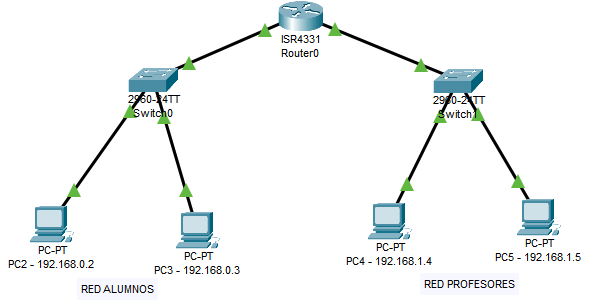
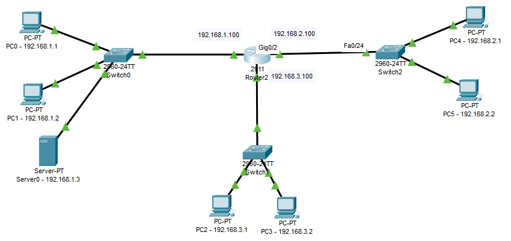
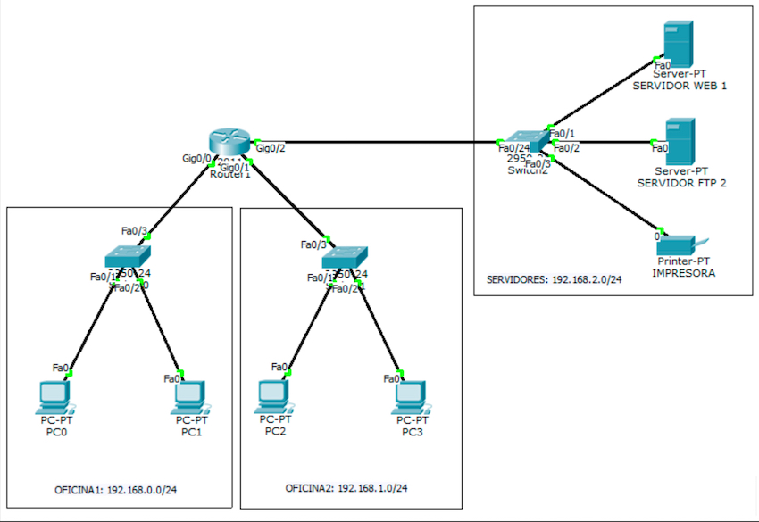
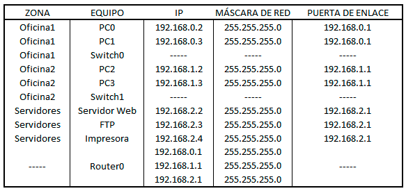
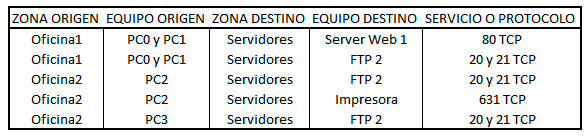

## EJERCICIO-1

Dada la siguiente topología de red realizar sobre la misma las actuaciones que se piden:




+ Cambiar el nombre del router a Router0

```
hostname router0
```

+ Mostrar las interfaces del router

```
show ip interface brief
```

+ Asignar a la interfaz `GigabitEthernet 0/0/0` la ip `192.168.0.1`

```
ip address 192.168.0.1 255.255.255.0
no shutdown
```

+ Asignar a la interfaz `GigabitEthernet 0/0/1` la ip `192.168.1.1`

```
ip address 192.168.1.1 255.255.255.0
no shutdown
```

+ Crear una regla ***ACL estándar*** de forma que la red de los alumnos no pueda conectarse a la red de los profesores. Mostrar las reglas creadas

```
access list 100 deny tcp 192.168.0.1 0.0.0.255 any eq 80

```

+ Borrar una regla ***ACL***

```
no access-list 100
```


+ Crear una regla ***ACL estándar*** donde el equipo `192.168.0.2` no pueda acceder a la red de profesores.

```
access-list 101 deny tcp 192.168.0.2 0.0.0.255 192.168.1.0 0.0.0.255
```

## EJERCICIO-2

Dada la siguiente topología de red, crear una ***ACL extendida*** que impida el tráfico `HTTP` desde la red `192.168.2.0/24` a la red `192.168.1.0/24` y que permita el resto del tráfico.



```
access-list 101 deny tcp 192.168.2.0 0.0.0.255 192.168.1.0 0.0.0.0.255 eq 80
access-list 101 permit ip any any
```

## EJERCICIO-3

Dada la siguiente topología de red en la que tenemos 2 oficinas con N equipos conectados en cada una de ellas ( en este caso hay 2 equipos ). En cada oficina hay un switch, y cada switch se conecta a un router central. Por último, tenemos una zona llamada servidores donde hay 3 servidores diferentes (servidor web, servidor ftp y una impresora):



El direccionamiento de red de cada uno de los equipos es el siguiente:



Crear una serie de reglas de acceso que permitirán el acceso entre una zona origen y una zona destino según la siguiente tabla:



>NOTA: Pega los comandos en cajas de código de forma limpia y ordenada

```

Router(config)#interface gigabitEthernet 0/0
Router(config-if)#ip address 192.168.0.1 255.255.255.0
Router(config-if)#no shutdown

Router(config)#interface gigabitEthernet 0/1
Router(config-if)#ip address 192.168.1.1 255.255.255.0
Router(config-if)#no shutdown

Router(config)#interface gigabitEthernet 0/2
Router(config-if)#ip address 192.168.2.1 255.255.255.0
Router(config-if)#no shutdown

Router(config)#access-list 101 permit tcp 192.168.0.2 0.0.0.255 192.168.0.3 0.0.0.255 eq 80
Router(config)#access-list 101 permit tcp 192.168.0.2 0.0.0.0 192.168.0.3 0.0.0.0 eq 80

```