**Ejercicio 5. Direccionamiento IP.**

Partiendo de una configuración de 3 switchs y 15 equipos, comprobar la comunicación
entre los equipos mediante el uso de direcciones IP y máscaras.

**Paso 1**. Insertar tres switchs 2950‐24 con los nombres SW01, SW02 y SW03, con la configuración

**Paso 2**. Insertar los 15 equipos con la configuración

**Paso 3**.
Calcular, de forma manual, qué equipos se comunican entre ellos. Comprobar estos cálculos con los aportados por las comunicaciones del ejemplo.

| NOMBRE | IP              | MASCARA DE SUBRED   | SWITCH | PUERTO | ULTIMO OCTECTO | NUMERO DE SUBREDES |                                                   RANGO DE IPs                                                  | HOSTS CON LOS QUE SE PUEDE COMUNICAR |
|--------|-----------------|---------------------|:------:|:------:|:--------------:|:------------------:|:---------------------------------------------------------------------------------------------------------------:|--------------------------------------|
|  PC01  | 192.168.1.101   | 255.255.255.**0**   |  SW01  |   11   | 00000000       |          1         | 192.168.1.1-192.168.1.254                                                                                       | PC05-PC07-PC09-PC13-PC15             |
|  PC02  | 192.168.1.121   | 255.255.255.**248** |  SW02  |   11   | 11111000       |         32         | 192.168.1.121-192.168.1.127                                                                                     |                                      |
|  PC03  | 192.168.1.140   | 255.255.255.**192** |  SW03  |   11   | 11000000       |          4         | 192.168.1.1-192.168.1.63 192.168.1.65-192.168.1.127 **192.168.1.129-192.168.1.191** 192.168.1.193-192.168.1.254 | PC04-PC11                            |
|  PC04  | 192.168.1.160   | 255.255.255.**128** |  SW01  |   12   | 10000000       |          2         | 192.168.1.1-192.168.1.127 **192.168.1.129-192.168.1.254**                                                       | PC03-PC09-PC10-PC11-PC15             |
|  PC05  | 192.168.1.1     | 255.255.255.**0**   |  SW02  |   12   | 00000000       |          1         | 192.168.1.1-192.168.1.254                                                                                       | PC01-PC06-PC07-PC09-PC13-PC15        |
|  PC06  | 192.168.1.11    | 255.255.255.**224** |  SW03  |   12   | 11100000       |          8         | 192.168.1.1-192.168.1.31                                                                                        | PC05-PC13                            |
|  PC07  | 192.168.1.111   | 255.255.255.**128** |  SW01  |   13   | 10000000       |          2         | **192.168.1.1-192.168.1.127** 192.168.1.129-192.168.1.254                                                       | PC05-PC01-PC13                       |
|  PC08  | 192.168.100.200 | 255.255.255.**240** |  SW02  |   13   | 11110000       |         16         | 192.168.1.193-192.168.1.207                                                                                     | Pc09-                                |
|  PC09  | 192.168.100.201 | 255.255.255.**0**   |  SW03  |   13   | 00000000       |          1         | 192.168.1.1-192.168.1.254                                                                                       | PC08-PC05-PC04-PC01-PC10-PC15        |
|  PC10  | 192.168.1.248   | 255.255.255.**128** |  SW01  |   14   | 10000000       |          2         | 192.168.1.1-192.168.1.127 **192.168.1.129-192.168.1.254**                                                       | PC09-PC04-PC15                       |
|  PC11  | 192.168.1.144   | 255.255.255.**192** |  SW02  |   14   | 11000000       |          4         | 192.168.1.1-192.168.1.63 192.168.1.65-192.168.1.127 **192.168.1.129-192.168.1.191** 192.168.1.193-192.168.1.254 | PC04-PC03                            |
|  PC12  | 192.168.1.211   | 255.255.255.**240** |  SW03  |   14   | 11110000       |         16         | 192.168.1.209-192.168.1.223                                                                                     | PC15                                 |
|  PC13  | 192.168.1.25    | 255.255.255.**128** |  SW01  |   15   | 10000000       |          2         | **192.168.1.1-192.168.1.127** 192.168.1.129-192.168.1.254                                                       | PC07-PC06-PC05-PC01                  |
|  PC14  | 192.168.1.33    | 255.255.255.**224** |  SW02  |   15   | 11100000       |          8         | 192.168.1.33-192.168.1.63                                                                                       |                                      |
|  PC15  | 192.168.1.222   | 255.255.255.**0**   |  SW03  |   15   | 00000000       |          1         | 192.168.1.1-192.168.1.254                                                                                       | PC12-PC10-PC09-PC05-PC04-PC01        |

**-Descargar el archivo del packet tracer**
[a5.pkt](./a2.pkt)

**Paso 4**. Comprobar las direcciones MAC que
ha aprendido cada uno de los switchs. Para ello,
entramos en el modo consola de cada uno de
los switchs.

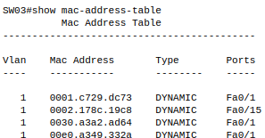

**Paso 5**. Cambiar la configuración de tal forma que los equipos se comuniquen en
grupos de 5 equipos (primer grupo PC01 al PC05, segundo grupo PC06 al PC10, tercer
grupo PC11 al PC15).

| NOMBRE | IP            | MASCARA DE SUBRED   | SWITCH | PUERTO | ULTIMO OCTECTO | NUMERO DE SUBREDES |                                                   RANGO DE IPs                                                  | HOSTS CON LOS QUE SE PUEDE COMUNICAR |
|--------|---------------|---------------------|:------:|:------:|:--------------:|:------------------:|:---------------------------------------------------------------------------------------------------------------:|--------------------------------------|
|  PC01  | 192.168.1.2   | 255.255.255.**192** |  SW01  |   11   | 11000000       |          4         | **192.168.1.1-192.168.1.63** 192.168.1.65-192.168.1.127 192.168.1.129-192.168.1.191 192.168.1.193-192.168.1.254 | PC01 al PC05                         |
|  PC02  | 192.168.1.3   | 255.255.255.**192** |  SW02  |   11   | 11000000       |          4         | **192.168.1.1-192.168.1.63** 192.168.1.65-192.168.1.127 192.168.1.129-192.168.1.191 192.168.1.193-192.168.1.254 | PC01 al PC05                         |
|  PC03  | 192.168.1.4   | 255.255.255.**192** |  SW03  |   11   | 11000000       |          4         | **192.168.1.1-192.168.1.63** 192.168.1.65-192.168.1.127 192.168.1.129-192.168.1.191 192.168.1.193-192.168.1.254 | PC01 al PC05                         |
|  PC04  | 192.168.1.5   | 255.255.255.**192** |  SW01  |   12   | 11000000       |          4         | **192.168.1.1-192.168.1.63** 192.168.1.65-192.168.1.127 192.168.1.129-192.168.1.191 192.168.1.193-192.168.1.254 | PC01 al PC05                         |
|  PC05  | 192.168.1.6   | 255.255.255.**192** |  SW02  |   12   | 11000000       |          4         | **192.168.1.1-192.168.1.63** 192.168.1.65-192.168.1.127 192.168.1.129-192.168.1.191 192.168.1.193-192.168.1.254 | PC01 al PC05                         |
|  PC06  | 192.168.1.67  | 255.255.255.**192** |  SW03  |   12   | 11000000       |          4         | 192.168.1.1-192.168.1.63 **192.168.1.65-192.168.1.127** 192.168.1.129-192.168.1.191 192.168.1.193-192.168.1.254 | PC06 al PC10                         |
|  PC07  | 192.168.1.68  | 255.255.255.**192** |  SW01  |   13   | 11000000       |          4         | 192.168.1.1-192.168.1.63 **192.168.1.65-192.168.1.127** 192.168.1.129-192.168.1.191 192.168.1.193-192.168.1.254 | PC06 al PC10                         |
|  PC08  | 192.168.1.69  | 255.255.255.**192** |  SW02  |   13   | 11000000       |          4         | 192.168.1.1-192.168.1.63 **192.168.1.65-192.168.1.127** 192.168.1.129-192.168.1.191 192.168.1.193-192.168.1.254 | PC06 al PC10                         |
|  PC09  | 192.168.1.70  | 255.255.255.**192** |  SW03  |   13   | 11000000       |          4         | 192.168.1.1-192.168.1.63 **192.168.1.65-192.168.1.127** 192.168.1.129-192.168.1.191 192.168.1.193-192.168.1.254 | PC06 al PC10                         |
|  PC10  | 192.168.1.71  | 255.255.255.**192** |  SW01  |   14   | 11000000       |          4         | 192.168.1.1-192.168.1.63 **192.168.1.65-192.168.1.127** 192.168.1.129-192.168.1.191 192.168.1.193-192.168.1.254 | PC06 al PC10                         |
|  PC11  | 192.168.1.130 | 255.255.255.**192** |  SW02  |   14   | 11000000       |          4         | 192.168.1.1-192.168.1.63 192.168.1.65-192.168.1.127 **192.168.1.129-192.168.1.191** 192.168.1.193-192.168.1.254 | PC11 al PC15                         |
|  PC12  | 192.168.1.131 | 255.255.255.**192** |  SW03  |   14   | 11000000       |          4         | 192.168.1.1-192.168.1.63 192.168.1.65-192.168.1.127 **192.168.1.129-192.168.1.191** 192.168.1.193-192.168.1.254 | PC11 al PC15                         |
|  PC13  | 192.168.1.132 | 255.255.255.**192** |  SW01  |   15   | 11000000       |          4         | 192.168.1.1-192.168.1.63 192.168.1.65-192.168.1.127 **192.168.1.129-192.168.1.191** 192.168.1.193-192.168.1.254 | PC11 al PC15                         |
|  PC14  | 192.168.1.133 | 255.255.255.**192** |  SW02  |   15   | 11000000       |          4         | 192.168.1.1-192.168.1.63 192.168.1.65-192.168.1.127 **192.168.1.129-192.168.1.191** 192.168.1.193-192.168.1.254 | PC11 al PC15                         |
|  PC15  | 192.168.1.134 | 255.255.255.**192** |  SW03  |   15   | 11000000       |          4         | 192.168.1.1-192.168.1.63 192.168.1.65-192.168.1.127 **192.168.1.129-192.168.1.191** 192.168.1.193-192.168.1.254 | PC11 al PC15                         |

**-Descargar el archivo del packet tracer**
[a5-2.pkt](./a2(2).pkt)

**Ejercicio 6. Seguridad y configuraciones de un switch**

**Paso 1**. Establecer la conexión con el switch utilizando la opción de enlace por Consola
y Terminal.

**Paso 2**. Establecer el nombre del equipo. Este es uno de los primeros pasos que se
suele realizar al configurar un switch. En nuestro caso, le pondremos el nombre
Mi_primer_switch. Esta acción la realizamos desde el modo comando de la siguiente
forma:

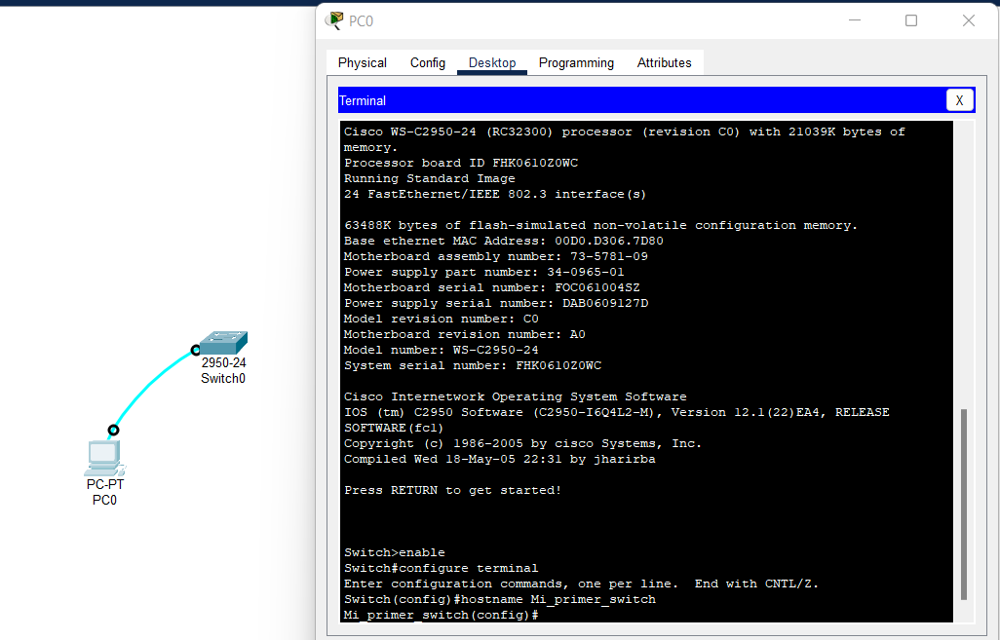

**Paso 3**. Desactivar avisos de consola. Es una acción muy habitual, ya que, con cada
modificación del estado de alguno de los parámetros del switch, se presenta un
mensaje por consola. Por ejemplo, cuando apagamos o encendemos un equipo, se
presentan mensajes del estado de ese puerto en el que estaba conectado el equipo.
Debemos comprobar que esto es así, y, usando los comandos siguientes,
comprobaremos que ya no se presentan dichas alertas.

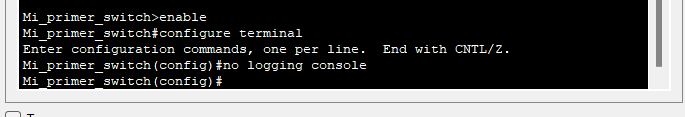

**Paso 4**. Contraseñas de acceso. Si nuestro switch es una parte importante de nuestra
configuración de red, es lógico que protejamos su acceso mediante el uso de
contraseñas.
En primer lugar, podemos establecer una contraseña para acceder al modo
privilegiado. Esto lo hacemos con los siguientes comandos:

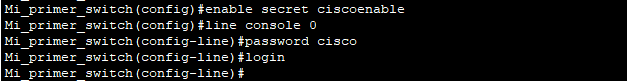
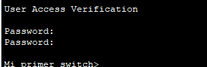

Para desactivar la contraseña del modo consola, llegando a config‐line tecleamos no
login. Para desactivar la contraseña del modo privilegiado, llegando a config tecleamos
no enable secret.

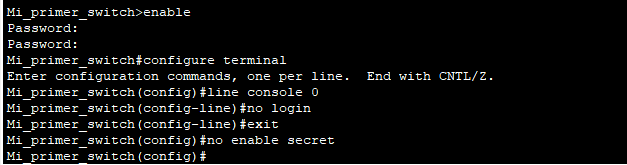

**Paso 5**. Configurar dirección IP, máscara y puerta de enlace del switch.
La dirección IP del propio switch la configuramos para su acceso a través de la VLAN1.
Por eso, muchos fabricantes, llaman a esta VLAN1 la de gestión, ya que el
equipamiento de red configura por ahí su acceso remoto por IP.
En modo comando, lo hacemos así:

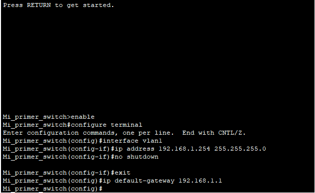

**Paso 6**. Guardar la configuración.
Con todos los pasos anteriores, hemos modificado la configuración de nuestro switch,
pero existe un problema: no hemos guardado la configuración.
Para verificar que esto es así, procedemos a recargar la configuración, que sería como
apagar y volver a encender el switch.

[a6-1.pkt](./a6-1.pkt)

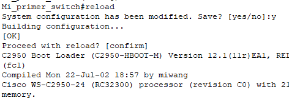
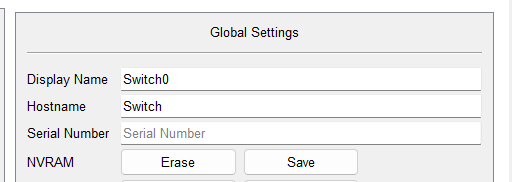

Al iniciar, comprobamos que los cambios en el switch no están (nombre del switch,
direcciones IP, etc.).
Volvemos a colocar el nombre al switch, y ahora grabaremos los cambios. Para realizar
esta acción, debemos saber que un equipo CISCO posee dos ficheros de configuración: 

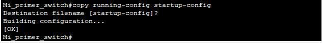

Ahora, realizamos un cambio en el nombre del switch (Paso 2), copiamos la
configuración y reiniciamos el switch. De esta forma comprobamos que nuestro equipo
ha mantenido el cambio de nombre.

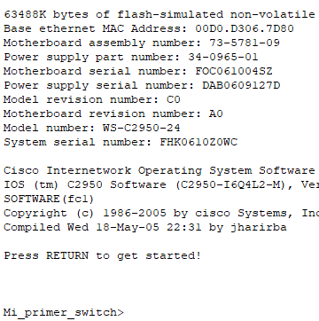

También volveremos a realizar el paso 5 de colocar la IP, ya que la necesitamos en el
paso siguiente, y grabaremos la configuración

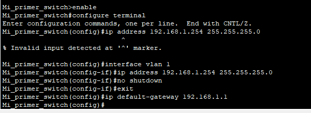

**Paso 7**. Acceso mediante Telnet.
Además de tener configurada una dirección IP para nuestro switch, éste posee 5
conexiones para telnet desde el exterior que pueden ser activadas. Lógicamente, al ser
conexiones externas, se debe establecer una contraseña para dicha conexión. Estas
acciones se realizan mediante lo comandos:

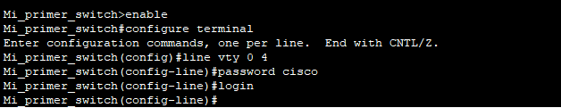

Ahora, procederemos a acceder desde un ordenador conectado a ese switch mediante
la opción de Escritorio, entrando en el modo comando, e invocando el comando
Telnet.

**-Descargar el archivo del packet tracer**
[a6-2.pkt](./a6-2.pkt)

**Ejercicio 7**. Configuración de puertos.

Auto‐negociación o fijado de velocidad.
Esta configuración la haremos utilizando el switch 2950T que posee dos puertos
Gigabit. En el PC que utilicemos vamos a colocar, en lugar de la tarjeta estándar que
viene, una tarjeta de par trenzado Gigabit. De esta forma tendremos una unión entre
el switch y el PC a Gigabit.
Veamos cual es la situación normal del puerto:

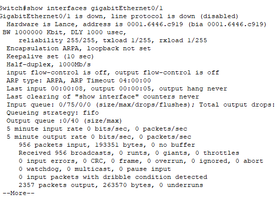

De esta forma comprobamos la velocidad del puerto.
Si queremos cambiarla, utilizamos los comandos: 

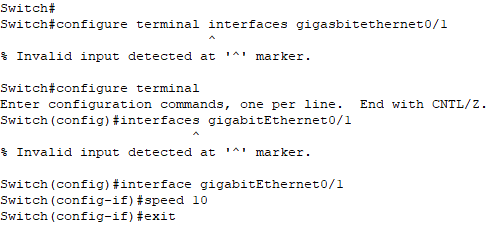

Y comprobamos que, ahora, la velocidad de nuestro puerto a cambia a 10 Mbps.

volvemos a colocar la velocidad en automático

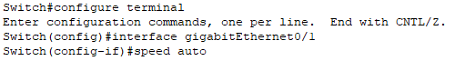

**Paso 2**. Desactivar un puerto.
Hay momentos en que podremos necesitar el desactivar un puerto, ya sea porque la
tarjeta de red del equipo no funciona correctamente, o por haber detectado que quien
hace uso de ese puerto no está autorizado.
Por este motivo, podemos desactivar un puerto.
Partiendo de la configuración anterior, podemos desactivar cualquier puerto del
switch. Esta acción la conseguimos con los comandos:
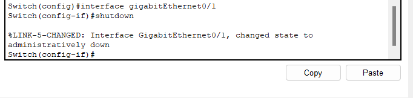

**-Descargar el archivo del packet tracer**
[a7.pkt](./a7.pkt)
