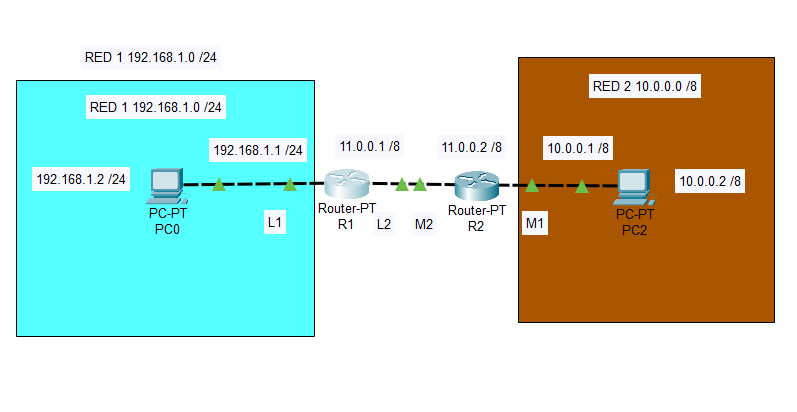

# EJERCICIO DE ENCAMINAMIENTO ESTÁTICO I

1. Realiza en Packet Tracer el diagrama de red tal y como el que se adjunta. Debes poner las direcciones ip que se indican así como los carteles.



2. Realiza un un ping entre el `PC0`y el `PC2`, pega el resultado en la caja de código:

```
C:\>ping 10.0.0.2

Pinging 10.0.0.2 with 32 bytes of data:

Reply from 192.168.1.1: Destination host unreachable.
Reply from 192.168.1.1: Destination host unreachable.
Reply from 192.168.1.1: Destination host unreachable.
Reply from 192.168.1.1: Destination host unreachable.

Ping statistics for 10.0.0.2:
    Packets: Sent = 4, Received = 0, Lost = 4 (100% loss),
``` 

3. Muestra las tablas `arp`de cada uno de los PC y de los routers:

+ PC0

```
C:\>arp -a
  Internet Address      Physical Address      Type
  192.168.1.1           0060.0fa2.d1ca        dynamic
```

+ PC2

```
C:\>arp -a
  Internet Address      Physical Address      Type
  10.0.0.1              000a.4192.e166        dynamic
```

+ Router R1

```
R1#show arp
Protocol  Address          Age (min)  Hardware Addr   Type   Interface
Internet  11.0.0.1                -   0060.4752.3405  ARPA   FastEthernet1/0
Internet  192.168.1.1             -   0050.0FA2.D1CA  ARPA   FastEthernet0/0
Internet  192.168.1.2             28  0040.F985.3EED  ARPA   FastEthernet0/0
```

+ Router R2

```
R2#show arp
Protocol  Address          Age (min)  Hardware Addr   Type   Interface
Internet  10.0.0.1                -   000A.4192.E166  ARPA   FastEthernet0/0
Internet  10.0.0.2                14  000B.BE91.EED8  ARPA   FastEthernet0/0
Internet  11.0.0.2                -   0002.17B2.5D0D  ARPA   FastEthernet1/0
```

4. Establece las rutas estáticas necesarias para que haya comunicación entre los dos equipos de las diferentes redes. Inserta una captura de ping desde cada máquina. Pega los comandos en las cajas de código y rellena las tablas adjuntas.

+ Router R1

```
R1(config)#ip route 10.0.0.0 255.255.255.0 11.0.0.2
```

***PEGAGAMOS LA TABLA DEL R1***


+ Router R2

```
R2(config)#ip route 192.168.1.0 255.255.255.0 11.0.0.1
```

***PEGAGAMOS LA TABLA DEL R2***


5. Realiza un un ping entre el `PC0`y el `PC2`, pega el resultado en la caja de código:

```
C:\>ping 10.0.0.2

Pinging 10.0.0.2 with 32 bytes of data:

Request timed out.
Reply from 10.0.0.2: bytes=32 time<1ms TTL=126
Reply from 10.0.0.2: bytes=32 time<1ms TTL=126
Reply from 10.0.0.2: bytes=32 time<1ms TTL=126

Ping statistics for 10.0.0.2:
    Packets: Sent = 4, Received = 3, Lost = 1 (25% loss),
Approximate round trip times in milli-seconds:
    Minimum = 0ms, Maximum = 0ms, Average = 0ms
``` 


6. Muestra las tablas `arp` de cada uno de los PC y de los routers:

+ PC0

```
C:\>arp -a
  Internet Address      Physical Address      Type
  192.168.1.1           0050.0fa2.d1ca        dynamic
```

+ PC2

```
C:\>arp -a
  Internet Address      Physical Address      Type
  10.0.0.1              000a.4192.e166        dynamic
```

+ Router R1

```
R1#show arp
Protocol  Address          Age (min)  Hardware Addr   Type   Interface
Internet  11.0.0.1                -   0060.4752.3405  ARPA   FastEthernet1/0
Internet  11.0.0.2                1   0002.17B2.5D0D  ARPA   FastEthernet1/0
Internet  192.168.1.1             -   0050.0FA2.D1CA  ARPA   FastEthernet0/0
Internet  192.168.1.2             39  00E0.F985.3EED  ARPA   FastEthernet0/0``

```

+ Router R2

```
R2#show arp 
Protocol  Address          Age (min)  Hardware Addr   Type   Interface
Internet  10.0.0.1                -   000A.4192.E166  ARPA   FastEthernet0/0
Internet  10.0.0.2                26  000B.BE91.EED8  ARPA   FastEthernet0/0
Internet  11.0.0.1                1   0060.4752.3405  ARPA   FastEthernet1/0
Internet  11.0.0.2                -   0002.17B2.5D0D  ARPA   FastEthernet1/0
```

