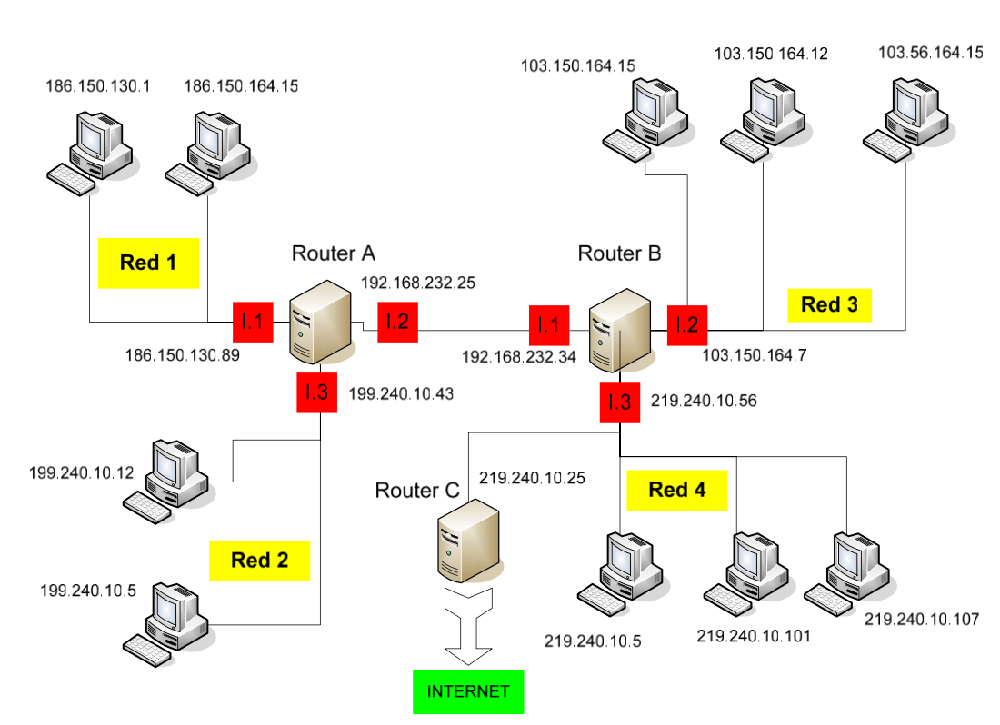

# EJERCICIO DE TABLAS DE ENCAMINAMIENTO

Dado el siguiente esquema:



1. Rellena las tablas de encaminamiento del `Router A`, `Router B` y `Router C` (usa las tablas que te suministra el profesor):

+ Router A
 

| DIRECCION DE RED | MASCARA       | ENCAMINADOR    | INTERFAZ | METRICA |
|------------------|---------------|----------------|----------|---------|
| 186.150.0.0      | 255.255.0.0   | 0.0.0.0        | L1       | 0       |
| 199.240.10.0     | 255.255.255.0 | 0.0.0.0        | L3       | 0       |
| 192.168.232.0    | 255.255.255.0 | 0.0.0.0        | L2       | 0       |
| 103.0.0.0        | 255.0.0.0     | 192.168.232.34 | L2       | 1       |
| 219.240.10.0     | 255.255.255.0 | 192.168.232.34 | L2       | 1       |
| 0.0.0.0          | 0.0.0.0       | 192.168.232.34 | L2       | 1       |


+ Router B


| DIRECCION DE RED | MASCARA       | ENCAMINADOR    | INTERFAZ | METRICA |
|------------------|---------------|----------------|----------|---------|
| 103.0.0.0        | 255.0.0.0     | 0.0.0.0        | L2       | 0       |
| 219.240.10.0     | 255.255.255.0 | 0.0.0.0        | L3       | 0       |
| 192.168.232.0    | 255.255.255.0 | 0.0.0.0        | L1       | 0       |
| 186.150.0.0      | 255.255.0.0   | 192.168.234.25 | L1       | 1       |
| 199.240.10.0     | 255.255.255.0 | 192.168.234.25 | L1       | 1       |
| 0.0.0.0          | 0.0.0.0       | 192.168.234.35 | L1       | 1       |


+ Router C


| DIRECCION DE RED | MASCARA       | ENCAMINADOR   | INTERFAZ | METRICA |
|------------------|---------------|---------------|----------|---------|
| 219.240.10.0     | 255.255.255.0 | 0.0.0.0       | L1       | 0       |
| 103.0.0.0        | 255.0.0.0     | 219.240.10.56 | L1       | 1       |
| 192.168.232.0    | 255.255.255.0 | 219.240.10.56 | L1       | 1       |
| 186.150.0.0      | 255.255.0.0   | 219.240.10.56 | L1       | 2       |
| 199.240.10.0     | 255.255.255.0 | 219.240.10.56 | L1       | 2       |
| 0.0.0.0          | 0.0.0.0       | 219.240.10.56 | L1       | 1       |


2. Realiza en Packet Tracer el diagrama de red tal y como el que se adjunta. Debes poner las direcciones ip que se indican así como los carteles. Configura en cada `PC` los parámetros de la red que le corresponden. Pon una imagen del resultado de tu montaje.


3. Establece el nombre de cada uno de los routers:

+ Router A

```
Router(config)#hostname RouterA
```

+ Router B

```
Router(config)#hostname RouterB
```

+ Router C

```
Router(config)#hostname RouterC
```

4. Configura el mensaje de bienvenida a cada uno de los routers `ROUTER A NOMBRE_ALUMNO`:

+ Router A

```
RouterA(config)#banner motd #Router A Ahiman#
```

+ Router B

```
RouterB(config)#banner motd #Router A Ahiman#
```

+ Router C

```
RouterC(config)#banner motd #Router A Ahiman#
```


5. Establece para cada router la contraseña `cisco2223` para el acceso a la configuración:

+ Router A

```
RouterA(config)#enable password cisco2223
```

+ Router B

```
RouterB(config)#enable password cisco2223
```

+ Router C

```
RouterC(config)#enable password cisco2223
```

6. Configura las direcciones `IP` de cada una de las interfaces de los routers:

+ Router A

```
RouterA(config)#interface FastEthernet0/0
RouterA(config-if)#ip address 186.150.130.89 255.255.0.0
RouterA(config)#interface Serial0/0/0
RouterA(config-if)#ip address 192.168.232.25 255.255.255.0
RouterA(config)#interface FastEthernet0/1
RouterA(config-if)#ip address 199.240.10.43 255.255.255.
```

+ Router B

```
RouterB(config)#interface FastEthernet0/0
RouterB(config-if)#ip address 103.150.164.7 255.0.0.0
RouterB(config)#interface FastEthernet0/1
RouterB(config-if)#ip address 219.240.10.56 255.255.255.0
RouterB(config)#interface Serial0/0/0
RouterB(config-if)#ip address 192.168.232.34 255.255.255.0
```

+ Router C

```
RouterC(config)#interface FastEthernet0/0
RouterC(config-if)#ip address 219.240.10.25 255.255.255.0
```

7. Muestra un resumen de la configuración de las interfaces de cada router:

+ Router A

```
RouterA#show ip interface brief
Interface              IP-Address      OK? Method Status                Protocol 
FastEthernet0/0        186.150.130.89  YES manual up                    up 
FastEthernet0/1        199.240.10.43   YES manual up                    up 
Serial0/0/0            192.168.232.25  YES manual up                    up 
Serial0/0/1            unassigned      YES unset  administratively down down 
Vlan1                  unassigned      YES unset  administratively down down
```

+ Router B

```
RouterB#show ip interface brief
Interface              IP-Address      OK? Method Status                Protocol 
FastEthernet0/0        103.150.164.7   YES manual up                    up 
FastEthernet0/1        219.240.10.56   YES manual up                    up 
Serial0/0/0            192.168.232.34  YES manual up                    up 
Serial0/0/1            unassigned      YES unset  administratively down down 
Serial0/2/0            unassigned      YES unset  administratively down down 
Vlan1                  unassigned      YES unset  administratively down down
```

+ Router C

```
RouterC#show ip interface brief
Interface              IP-Address      OK? Method Status                Protocol 
FastEthernet0/0        219.240.10.25   YES manual up                    up 
FastEthernet0/1        unassigned      YES unset  administratively down down 
Serial0/2/0            unassigned      YES unset  administratively down down 
Vlan1                  unassigned      YES unset  administratively down down
```


8. Configura en cada router las rutas estáticas en base las tablas que has rellenado en el apartado 1:

+ Router A

```
RouterA(config)# ip route 103.0.0.0 255.0.0.0 192.168.232.34
RouterA(config)#ip route 219.240.10.0 255.0.0.0 192.168.232.34
```

+ Router B

```
RouterB(config)#ip route 186.150.0.0 255.255.0.0 192.168.234.25
RouterB(config)#ip route 199.240.10.0 255.255.255.0 192.168.234.25
```

+ Router C

```
RouterC(config)#ip route 103.0.0.0 255.0.0.0 219.240.10.56
RouterC(config)#ip route 186.150.0.0 255.255.0.0 219.240.10.56
RouterC(config)#ip route 192.168.232.0 255.255.255.0 219.240.10.56
RouterC(config)#ip route 199.240.10.0 255.255.255.0 219.240.10.56
```

9. Muestra la tabla de enrutamiendo de cada router:

+ Router A

```
RouterA#show ip route
Codes: L - local, C - connected, S - static, R - RIP, M - mobile, B - BGP
       D - EIGRP, EX - EIGRP external, O - OSPF, IA - OSPF inter area
       N1 - OSPF NSSA external type 1, N2 - OSPF NSSA external type 2
       E1 - OSPF external type 1, E2 - OSPF external type 2, E - EGP
       i - IS-IS, L1 - IS-IS level-1, L2 - IS-IS level-2, ia - IS-IS inter area
       * - candidate default, U - per-user static route, o - ODR
       P - periodic downloaded static route

Gateway of last resort is not set

S    103.0.0.0/8 [1/0] via 192.168.232.34
     186.150.0.0/16 is variably subnetted, 2 subnets, 2 masks
C       186.150.0.0/16 is directly connected, FastEthernet0/0
L       186.150.130.89/32 is directly connected, FastEthernet0/0
     192.168.232.0/24 is variably subnetted, 2 subnets, 2 masks
C       192.168.232.0/24 is directly connected, Serial0/0/0
L       192.168.232.25/32 is directly connected, Serial0/0/0
     199.240.10.0/24 is variably subnetted, 2 subnets, 2 masks
C       199.240.10.0/24 is directly connected, FastEthernet0/1
L       199.240.10.43/32 is directly connected, FastEthernet0/1
S    219.240.10.0/24 [1/0] via 192.168.232.34
```

+ Router B

```
RouterB#show ip route
Codes: L - local, C - connected, S - static, R - RIP, M - mobile, B - BGP
       D - EIGRP, EX - EIGRP external, O - OSPF, IA - OSPF inter area
       N1 - OSPF NSSA external type 1, N2 - OSPF NSSA external type 2
       E1 - OSPF external type 1, E2 - OSPF external type 2, E - EGP
       i - IS-IS, L1 - IS-IS level-1, L2 - IS-IS level-2, ia - IS-IS inter area
       * - candidate default, U - per-user static route, o - ODR
       P - periodic downloaded static route

Gateway of last resort is not set

     103.0.0.0/8 is variably subnetted, 2 subnets, 2 masks
C       103.0.0.0/8 is directly connected, FastEthernet0/0
L       103.150.164.7/32 is directly connected, FastEthernet0/0
     192.168.232.0/24 is variably subnetted, 2 subnets, 2 masks
C       192.168.232.0/24 is directly connected, Serial0/0/0
L       192.168.232.34/32 is directly connected, Serial0/0/0
     219.240.10.0/24 is variably subnetted, 2 subnets, 2 masks
C       219.240.10.0/24 is directly connected, FastEthernet0/1
L       219.240.10.56/32 is directly connected, FastEthernet0/1
```

+ Router C

```
RouterC#show ip route
Codes: L - local, C - connected, S - static, R - RIP, M - mobile, B - BGP
       D - EIGRP, EX - EIGRP external, O - OSPF, IA - OSPF inter area
       N1 - OSPF NSSA external type 1, N2 - OSPF NSSA external type 2
       E1 - OSPF external type 1, E2 - OSPF external type 2, E - EGP
       i - IS-IS, L1 - IS-IS level-1, L2 - IS-IS level-2, ia - IS-IS inter area
       * - candidate default, U - per-user static route, o - ODR
       P - periodic downloaded static route

Gateway of last resort is not set

S    103.0.0.0/8 [1/0] via 219.240.10.56
S    186.150.0.0/16 [1/0] via 219.240.10.56
S    192.168.232.0/24 [1/0] via 219.240.10.56
S    199.240.10.0/24 [1/0] via 219.240.10.56
     219.240.10.0/24 is variably subnetted, 2 subnets, 2 masks
C       219.240.10.0/24 is directly connected, FastEthernet0/0
L       219.240.10.25/32 is directly connected, FastEthernet0/0
```

10. Antes de hacer `ping` entre hosts muestra la tabla `arp` de los routers y de un `PC` de cada red:

+ Router A

```
RouterA#show arp 
Protocol  Address          Age (min)  Hardware Addr   Type   Interface
Internet  186.150.130.89          -   0002.16CE.3001  ARPA   FastEthernet0/0
Internet  199.240.10.43           -   0002.16CE.3002  ARPA   FastEthernet0/1
```

+ Router B

```
RouterB#show arp
Protocol  Address          Age (min)  Hardware Addr   Type   Interface
Internet  103.150.164.7           -   0060.473C.6201  ARPA   FastEthernet0/0
Internet  219.240.10.56           -   0060.473C.6202  ARPA   FastEthernet0/1
```

+ Router C

```
RouterC#show arp
Protocol  Address          Age (min)  Hardware Addr   Type   Interface
Internet  219.240.10.25           -   0004.9A70.A301  ARPA   FastEthernet0/0
```

+ PC de la RED 1

```
C:\>arp -a
No ARP Entries Found
``` 

+ PC de la RED 2

```
C:\>arp -a
No ARP Entries Found
``` 

+ PC de la RED 3

```
C:\>arp -a
No ARP Entries Found
``` 


11. Realiza un un ping entre un PC de cada una de las redes con otro para comprobar la conectividad:

+ RED 1 -> RED 2

```
C:\>ping 199.240.10.12

Pinging 199.240.10.12 with 32 bytes of data:

Request timed out.
Reply from 199.240.10.12: bytes=32 time<1ms TTL=127
Reply from 199.240.10.12: bytes=32 time<1ms TTL=127
Reply from 199.240.10.12: bytes=32 time<1ms TTL=127

Ping statistics for 199.240.10.12:
    Packets: Sent = 4, Received = 3, Lost = 1 (25% loss),
Approximate round trip times in milli-seconds:
    Minimum = 0ms, Maximum = 0ms, Average = 0ms
``` 

+ RED 1 -> RED 3

```
Pinging 103.150.164.15 with 32 bytes of data:

Reply from 103.150.164.15: bytes=32 time=14ms TTL=126
Reply from 103.150.164.15: bytes=32 time=8ms TTL=126
Reply from 103.150.164.15: bytes=32 time=1ms TTL=126
Reply from 103.150.164.15: bytes=32 time=8ms TTL=126

Ping statistics for 103.150.164.15:
    Packets: Sent = 4, Received = 4, Lost = 0 (0% loss),
Approximate round trip times in milli-seconds:
    Minimum = 1ms, Maximum = 14ms, Average = 7ms
``` 

+ RED 1 -> RED 4

```
C:\>ping 219.240.10.107

Pinging 219.240.10.107 with 32 bytes of data:

Request timed out.
Reply from 219.240.10.107: bytes=32 time=3ms TTL=126
Reply from 219.240.10.107: bytes=32 time=11ms TTL=126
Reply from 219.240.10.107: bytes=32 time=5ms TTL=126

Ping statistics for 219.240.10.107:
    Packets: Sent = 4, Received = 3, Lost = 1 (25% loss),
Approximate round trip times in milli-seconds:
    Minimum = 3ms, Maximum = 11ms, Average = 6ms
``` 

+ RED 2 -> RED 1

```
C:\>ping 186.150.130.1

Pinging 186.150.130.1 with 32 bytes of data:

Reply from 186.150.130.1: bytes=32 time<1ms TTL=127
Reply from 186.150.130.1: bytes=32 time<1ms TTL=127
Reply from 186.150.130.1: bytes=32 time<1ms TTL=127
Reply from 186.150.130.1: bytes=32 time<1ms TTL=127

Ping statistics for 186.150.130.1:
    Packets: Sent = 4, Received = 4, Lost = 0 (0% loss),
Approximate round trip times in milli-seconds:
    Minimum = 0ms, Maximum = 0ms, Average = 0ms

``` 

+ RED 2 -> RED 3

```
C:\>ping 103.150.164.15

Pinging 103.150.164.15 with 32 bytes of data:

Reply from 103.150.164.15: bytes=32 time=2ms TTL=126
Reply from 103.150.164.15: bytes=32 time=14ms TTL=126
Reply from 103.150.164.15: bytes=32 time=21ms TTL=126
Reply from 103.150.164.15: bytes=32 time=5ms TTL=126

Ping statistics for 103.150.164.15:
    Packets: Sent = 4, Received = 4, Lost = 0 (0% loss),
Approximate round trip times in milli-seconds:
    Minimum = 2ms, Maximum = 21ms, Average = 10ms

``` 

+ RED 2 -> RED 4

```
C:\>ping 219.240.10.5

Pinging 219.240.10.5 with 32 bytes of data:

Reply from 219.240.10.5: bytes=32 time=13ms TTL=126
Reply from 219.240.10.5: bytes=32 time=7ms TTL=126
Reply from 219.240.10.5: bytes=32 time=14ms TTL=126
Reply from 219.240.10.5: bytes=32 time=14ms TTL=126

Ping statistics for 219.240.10.5:
    Packets: Sent = 4, Received = 4, Lost = 0 (0% loss),
Approximate round trip times in milli-seconds:
    Minimum = 7ms, Maximum = 14ms, Average = 12ms
``` 

+ RED 3 -> RED 1

```
Cisco Packet Tracer PC Command Line 1.0
C:\>ping 186.150.130.1

Pinging 186.150.130.1 with 32 bytes of data:

Reply from 186.150.130.1: bytes=32 time=13ms TTL=126
Reply from 186.150.130.1: bytes=32 time=12ms TTL=126
Reply from 186.150.130.1: bytes=32 time=10ms TTL=126
Reply from 186.150.130.1: bytes=32 time=13ms TTL=126

Ping statistics for 186.150.130.1:
    Packets: Sent = 4, Received = 4, Lost = 0 (0% loss),
Approximate round trip times in milli-seconds:
    Minimum = 10ms, Maximum = 13ms, Average = 12ms
``` 

+ RED 3 -> RED 2

```
C:\>ping 199.240.10.12

Pinging 199.240.10.12 with 32 bytes of data:

Reply from 199.240.10.12: bytes=32 time=9ms TTL=126
Reply from 199.240.10.12: bytes=32 time=13ms TTL=126
Reply from 199.240.10.12: bytes=32 time=7ms TTL=126
Reply from 199.240.10.12: bytes=32 time=5ms TTL=126

Ping statistics for 199.240.10.12:
    Packets: Sent = 4, Received = 4, Lost = 0 (0% loss),
Approximate round trip times in milli-seconds:
    Minimum = 5ms, Maximum = 13ms, Average = 8ms
``` 

+ RED 3 -> RED 4

```
C:\>ping 219.240.10.5

Pinging 219.240.10.5 with 32 bytes of data:

Reply from 219.240.10.5: bytes=32 time=1ms TTL=127
Reply from 219.240.10.5: bytes=32 time=7ms TTL=127
Reply from 219.240.10.5: bytes=32 time<1ms TTL=127
Reply from 219.240.10.5: bytes=32 time<1ms TTL=127

Ping statistics for 219.240.10.5:
    Packets: Sent = 4, Received = 4, Lost = 0 (0% loss),
Approximate round trip times in milli-seconds:
    Minimum = 0ms, Maximum = 7ms, Average = 2ms
``` 

+ RED 4 -> RED 1

```
C:\>ping 186.150.130.1

Pinging 186.150.130.1 with 32 bytes of data:

Reply from 186.150.130.1: bytes=32 time=15ms TTL=126
Reply from 186.150.130.1: bytes=32 time=10ms TTL=126
Reply from 186.150.130.1: bytes=32 time=11ms TTL=126
Reply from 186.150.130.1: bytes=32 time=11ms TTL=126

Ping statistics for 186.150.130.1:
    Packets: Sent = 4, Received = 4, Lost = 0 (0% loss),
Approximate round trip times in milli-seconds:
    Minimum = 10ms, Maximum = 15ms, Average = 11ms
``` 

+ RED 4 -> RED 2

```
C:\>ping 199.240.10.12

Pinging 199.240.10.12 with 32 bytes of data:

Reply from 199.240.10.12: bytes=32 time=13ms TTL=126
Reply from 199.240.10.12: bytes=32 time=12ms TTL=126
Reply from 199.240.10.12: bytes=32 time=12ms TTL=126
Reply from 199.240.10.12: bytes=32 time=11ms TTL=126

Ping statistics for 199.240.10.12:
    Packets: Sent = 4, Received = 4, Lost = 0 (0% loss),
Approximate round trip times in milli-seconds:
    Minimum = 11ms, Maximum = 13ms, Average = 12ms
``` 

+ RED 4 -> RED 3

```
C:\>ping 103.150.164.15

Pinging 103.150.164.15 with 32 bytes of data:

Reply from 103.150.164.15: bytes=32 time<1ms TTL=127
Reply from 103.150.164.15: bytes=32 time<1ms TTL=127
Reply from 103.150.164.15: bytes=32 time<1ms TTL=127
Reply from 103.150.164.15: bytes=32 time<1ms TTL=127

Ping statistics for 103.150.164.15:
    Packets: Sent = 4, Received = 4, Lost = 0 (0% loss),
Approximate round trip times in milli-seconds:
    Minimum = 0ms, Maximum = 0ms, Average = 0ms
``` 

12. Vuelve a  mostrar la tabla `arp` de los routers y de un `PC` de cada red:

+ Router A

```
RouterA#show arp
Protocol  Address          Age (min)  Hardware Addr   Type   Interface
Internet  186.150.130.1           25  000A.41D0.3CC5  ARPA   FastEthernet0/0
Internet  186.150.130.89          -   0002.16CE.3001  ARPA   FastEthernet0/0
Internet  199.240.10.12           25  0001.4285.D09E  ARPA   FastEthernet0/1
Internet  199.240.10.43           -   0002.16CE.3002  ARPA   FastEthernet0/1
```

+ Router B

```
RouterB#show arp
Protocol  Address          Age (min)  Hardware Addr   Type   Interface
Internet  103.150.164.7           -   0060.473C.6201  ARPA   FastEthernet0/0
Internet  103.150.164.15          25  0002.17A9.AE6D  ARPA   FastEthernet0/0
Internet  219.240.10.5            24  0001.6491.2CEE  ARPA   FastEthernet0/1
Internet  219.240.10.56           -   0060.473C.6202  ARPA   FastEthernet0/1
Internet  219.240.10.107          6   0060.70E9.435A  ARPA   FastEthernet0/1
```

+ Router C

```
RouterC#show arp
Protocol  Address          Age (min)  Hardware Addr   Type   Interface
Internet  219.240.10.25           -   0004.9A70.A301  ARPA   FastEthernet0/0
```

+ PC de la RED 1

```
C:\>arp -a
  Internet Address      Physical Address      Type
  186.150.130.89        0002.16ce.3001        dynamic

``` 

+ PC de la RED 2

```
C:\>arp -a
  Internet Address      Physical Address      Type
  199.240.10.43         0002.16ce.3002        dynamic
``` 

+ PC de la RED 3

```
C:\>arp -a
  Internet Address      Physical Address      Type
  103.150.164.7         0060.473c.6201        dynamic
``` 
+ PC de la RED 4

```
C:\>arp -a
  Internet Address      Physical Address      Type
  219.240.10.56         0060.473c.6202        dynamic
``` 

13. Salva la configuración de cada uno de los routers:

+ Router A

```
RouterA#copy running-config startup-config 
Destination filename [startup-config]? 
Building configuration...
[OK]
```

+ Router B

```
RouterB#copy running-config startup-config 
Destination filename [startup-config]? 
Building configuration...
[OK]
```

+ Router C

```
RouterC#copy running-config startup-config 
Destination filename [startup-config]? 
Building configuration...
[OK]
```
