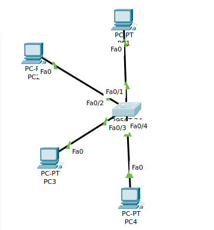

## EJERCICICO 1
1. Topologia de red

2. Para monstrar todas las vlan del switch ejecutamos este comando

ahiman_sw#show vlan brief

VLAN Name                             Status    Ports
---- -------------------------------- --------- -------------------------------
1    default                          active    Fa0/1, Fa0/5, Fa0/6, Fa0/7
                                                Fa0/8, Fa0/9, Fa0/10, Fa0/11
                                                Fa0/12, Fa0/13, Fa0/14, Fa0/15
                                                Fa0/16, Fa0/17, Fa0/18, Fa0/19
                                                Fa0/20, Fa0/21, Fa0/22, Fa0/23
                                                Fa0/24, Gig0/1, Gig0/2
1002 fddi-default                     active    
1003 token-ring-default               active    
1004 fddinet-default                  active    
1005 trnet-default                    active  

Para configurar un puerto como trunk en un switch en Packet Tracer mediante la CLI, puedes usar los siguientes comandos:

3. Para insertar una nueva vlan ejecutamos:

ahiman_sw#configure terminal 
ahiman_sw(config)#vlan 2
ahiman_sw(config-vlan)#name PRUEBAV2
ahiman_sw(config-vlan)#

4. Comprobamos que se ha creado correctamente la nueva Vlan

ahiman_sw#show vlan brief

VLAN Name                             Status    Ports
---- -------------------------------- --------- -------------------------------
1    default                          active    Fa0/1, Fa0/5, Fa0/6, Fa0/7
                                                Fa0/8, Fa0/9, Fa0/10, Fa0/11
                                                Fa0/12, Fa0/13, Fa0/14, Fa0/15
                                                Fa0/16, Fa0/17, Fa0/18, Fa0/19
                                                Fa0/20, Fa0/21, Fa0/22, Fa0/23
                                                Fa0/24, Gig0/1, Gig0/2
2    PRUEBAV2                         active    Fa0/2
1002 fddi-default                     active    
1003 token-ring-default               active    
1004 fddinet-default                  active    
1005 trnet-default                    active

Para realizar la siguiente configuracion:

ahiman_sw(config)#interface fastEthernet 0/2
ahiman_sw(config-if)#switchport access vlan 2
ahiman_sw(config-if)#exit
ahiman_sw(config)#interface fastEthernet 0/4
ahiman_sw(config-if)#switchport access vlan 2
ahiman_sw(config-if)#

5. Comprobamos que se hayan aplicado correctamente los puertos

VLAN Name                             Status    Ports
---- -------------------------------- --------- -------------------------------
1    default                          active    Fa0/1, Fa0/5, Fa0/6, Fa0/7
                                                Fa0/8, Fa0/9, Fa0/10, Fa0/11
                                                Fa0/12, Fa0/13, Fa0/14, Fa0/15
                                                Fa0/16, Fa0/17, Fa0/18, Fa0/19
                                                Fa0/20, Fa0/21, Fa0/22, Fa0/23
                                                Fa0/24, Gig0/1, Gig0/2
2    PRUEBAV2                         active    Fa0/2, Fa0/4
1002 fddi-default                     active    
1003 token-ring-default               active    
1004 fddinet-default                  active    
1005 trnet-default                    active

Comprobamos con pings que todo vaya bien

## EJERCICIO 2

1. Creamos esta topología

2. Insertamos la vlan 2 y vlan 3 en todos los switch

Switch(config)#vlan 2
Switch(config-vlan)#name PRUEBAV2
Switch(config-vlan)#exit
Switch(config)#vlan 3
Switch(config-vlan)#name PRUEBAV3

Confirmamos que se hayan creado correctamente

Switch#show vlan brief

VLAN Name                             Status    Ports
---- -------------------------------- --------- -------------------------------
1    default                          active    Fa0/1, Fa0/2, Fa0/3, Fa0/4
                                                Fa0/5, Fa0/6, Fa0/7, Fa0/8
                                                Fa0/9, Fa0/10, Fa0/11, Fa0/12
                                                Fa0/13, Fa0/14, Fa0/15, Fa0/16
                                                Fa0/17, Fa0/18, Fa0/19, Fa0/20
                                                Fa0/21, Fa0/22, Fa0/23, Fa0/24
                                                Gig0/1, Gig0/2
2    PRUEBAV2                         active    
3    PRUEBAV3                         active    
1002 fddi-default                     active    
1003 token-ring-default               active    
1004 fddinet-default                  active    
1005 trnet-default                    active

3. Realizar la siguiente configuración

Switch(config)#interface fastEthernet 0/3
Switch(config-if)#switchport access vlan 3
Switch(config-if)#

4. Ahora que hemos configurado las Vlan vamos a guardar la configuración del switch de modo que si lo reiniciamos la cargue, para ellos ejecutamos:
## IMPORTANTE

Switch#copy running-config startup-config
Destination filename [startup-config]? 
Building configuration...
[OK]

5. Conectamos los switch y ponemos en trocal esas salidas.

Comprobar que las comunicaciones entre los swichs funcionan correctamente. ¿Es esto
cierto? ¿Para qué VLAN funciona correctamente?

Vemos que en la Vlan 1 si hay comunicacion, esto se debe a que es la Vlan por defecto

Comprobamos la Vlan 2

Vemos que no funciona y es porque no estan los switch trunk

