

# UT3-A1 Construcción de cables UTP.

***Nombre:Diego Luis Garcia y Ahiman Bethencourt Mesa***
***Curso:*** 2º de Ciclo Superior de Administración de Sistemas Informáticos en Red.

### ÍNDICE

+ [Introducción](#id1)
+ [Objetivos](#id2)
+ [Material empleado](#id3)
+ [Desarrollo](#id4)
+ [Conclusiones](#id5)

#### ***Introducción***. 

UT3-A1 Construcción de cables UTP

#### ***Objetivos***. 

El objetivo de esta práctica es realizar la construción de un cable UTP de par trenzado. La práctica se hará en grupos de dos personas, cada una de las cuales realizará el crimpado de uno de los dos extremos.

#### ***Material empleado***. 

- Crimpadora
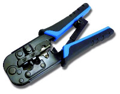
- Tijeras
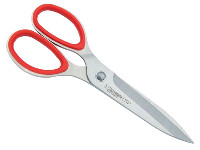
- Tester para Comprobar cables
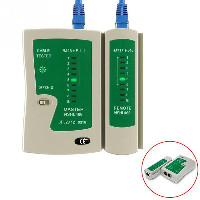
- Cableado
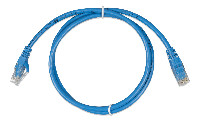
- Pela Cables
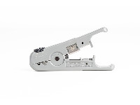 

#### ***Desarrollo***. 
**Cable Cruzado**
 
Pelamos el cable lo ordenamos en los colores correspondientes y luego lo cortamos para meterlo dentro del la boca.
 
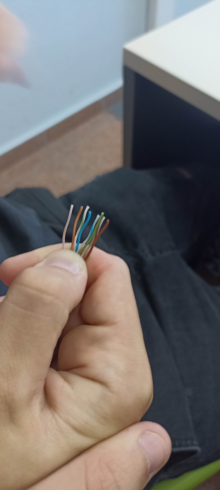
 
Asi quedaria el cable una vez pelado y metido en el RJ45.
 
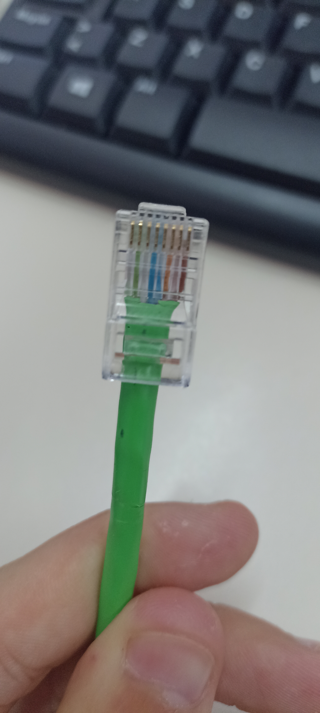
 
Y luego repetimos lo realizado anteriormente en el otro extremo del cable.
 
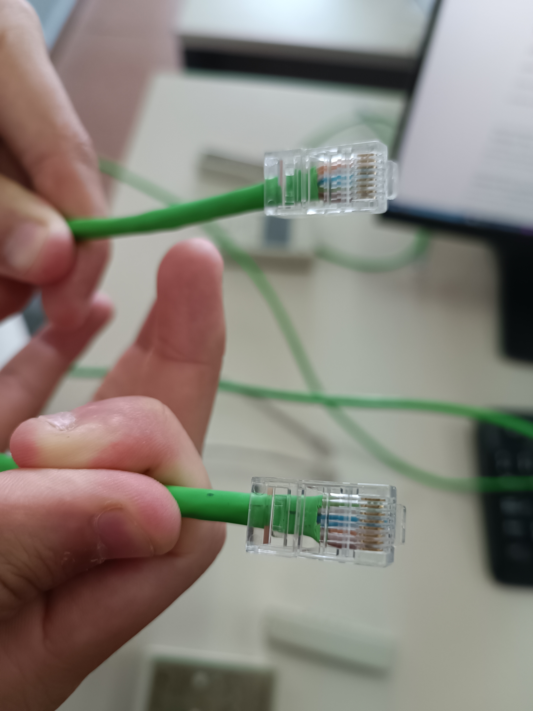
**Cable Directo**
 
Hacemos el mismo proceso que con el cruzado, pelamos el cable, ordenamos en colores y cortamos para introducir los cables dentro de la boca.
 

 
Hacemos el mismo patron de colores en el cable directo en ambas puntas del cable.
 
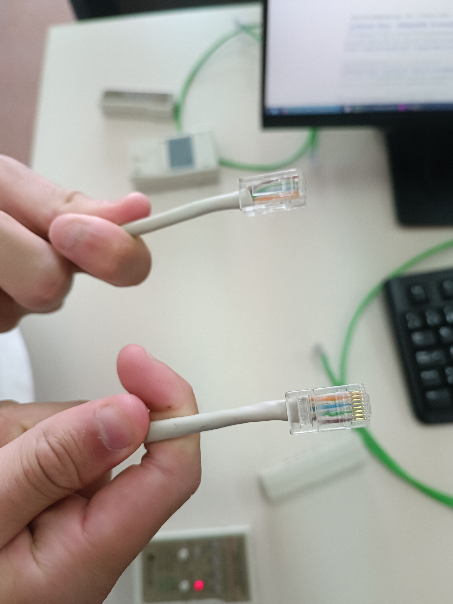
 
**Cable Hembra**
 
Haremos lo mismo que los anteriores cables pero usaremos un conector hembra rj45 y pondremos cada cable en su casilla correspondiente
 
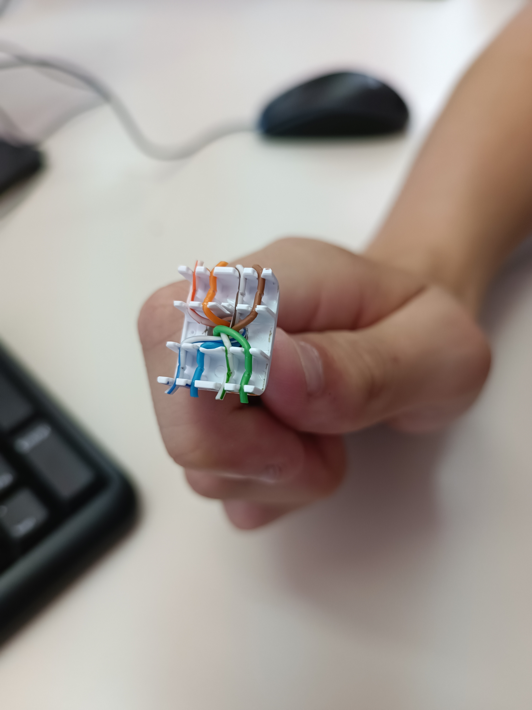
 
Una vez puesto bien los cables lo cerramos con la otra parte de conector
 
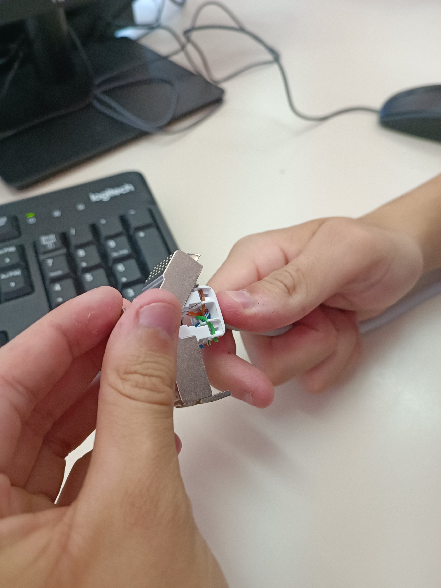
 
Una vez dentro sellamos bien y listo ya estaria el lado hembra
 
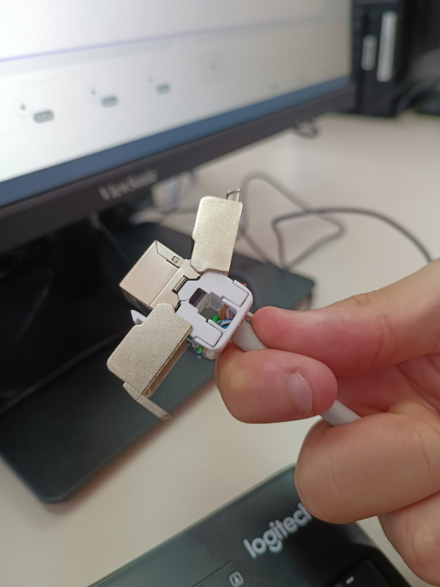
 
En el otro lado del cable hacemos un directo como realizamos anteriormente
 
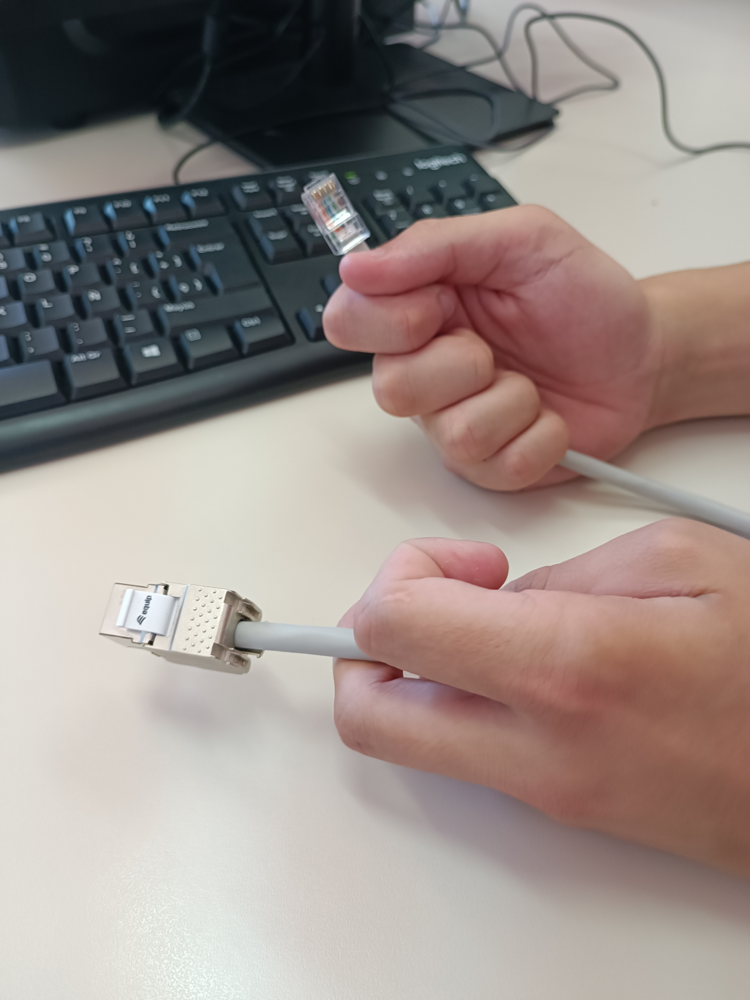
 

**VIDEO:**
 
https://youtu.be/Gq8uUIBP0k0
 
#### ***Conclusion***. 
Nosotros pensabamos que los cables eran mas faciles de hacer y no sabiamos que tenian que ir con un patron de colores para que pudiese funcionar y gracias a esta practica le hemos dado la importancia necesaria a los cables lo que cuesta hacerlos y recojimos conocimientos sobre la paleta de colores que necesitas poner para realizar un cable cruzado o directo.

